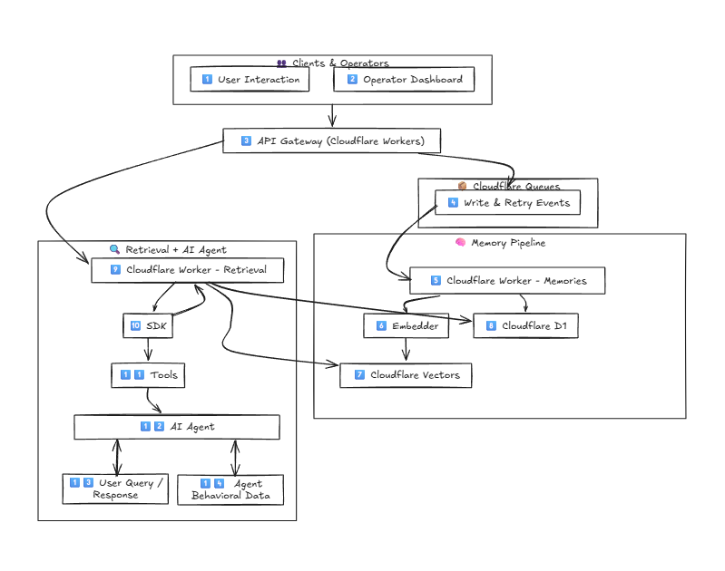

# MeridianDB Overview

AI-first, Auto-RAG, a serverless database that enhances RAG with multi-dimensional retrieval. In addition to semantic search, we added temporal and behavioral awareness as well. NewSQL-inspired eventual consistency keeps all the vector database, content, features data synced across Cloudflare D1 and Vectorize. 

Leverages Cloudflare edge network with the great deal of innovation, the entire RAG pipeline runs near where your users are.

## Core Problem

Traditional RAG suffers from:

- Catastrophic forgetting - AI retreival tend to forget important information. MeridianDB aims to improve tradtional RAG with multi-features on top of semantic to minimize or even elimante AI responses that forget important information.
- Lack of temporal awareness - All LLMs, tradtional vector, vector-graph databases lack tempooral sense in retreival, we designed and implemented intelligent algorithms and data-structure that target such problem.
- No behavioral learning - Some stored agent memories leads to terrible responses our system allow developers to integrate feedback loop between the users ( who uses your RAG pipeline ) and memories. Think like ChatGPT like/dislike button behind it very smart contnious learning that can be taken from passive to active phase with chainging agent configuration. 

## Solution
Multi-dimensional retrieval:
- **Semantic**: Vector similarity search it's machine way of representing and understanding meaning behind text, video, images, audio ( note MeridianDB currently only support text )
- **Temporal**: Time-based memory decay - determine the temporal revlence of data as time go forward, how often the record is accessed by the agent, and who fast it decays.
- **Contextual**: Task/environment context for the AI agent about the memory.
- **Behavioral**: Success-based optimization when memories are used in generation, and user doesn't like it all data will get negative socring, we recommend setting the stability thrushhold to low value for a while, allowing your agent to collect enough behavioral metrices about your data, then you can set it to something that suits your usecase. 

## Architecture

- (1), (2) **Human clients**: SDKs is for **Agentic AI developers**  Admin Portal for **DB operators**.

- (3) **Worker API gateway**: Handles requests from both **clients** and **SDK integrations**.

- (4) **Eventual consistency model**: **Write operations** are queued, simplifying retries and error handling. Follows **Cloudflare’s consistency model** for **Vectorize**.

- (5), (6), (7), (8) **Queues**: Publish **write events** consumed by workers for **vectorization** and **D1**. Main goal is to keep retreival latency low and update features.

- (9) **Retrieval engine**: Performs **multi-dimensional queries** for the **AI agent**

- (10), (11), (12), (13), (14) **Behavioral logging**: Tracks **Memory performance** on tasks based on user feedback. Creates a **feedback loop** for continuous improvement. Configurable passive/active learning for each agent. 

## Mostly Tabular Data for Features no Graphs

In MeridianDB we aimed to maximize scalability and performance, therefore we designed to store extra features ( temporal and behavioral ) into SQL columns. 

We gurantee eventual consitency, we provide multiple settings that control the consistency experience to fit your business needs. 

The process is as follow :

1. Agent send a retreival query.
2. MeridianDB backend perform a similarity search on the query, with intentional over-fetching the results ( configurable ) with ( TOP-K) parameter.
3. Content is fetched from D1.
4. Data is filtered-out based on agent configuration, global configuration for all semantic, temporal, behavioral, contextual features.
5. Temporal features job is enqueued for updating. Note we use event driven programming, the writes will be only published via queue, therefore, updating temporal features shouldn't have any impact on retreival speed. 
